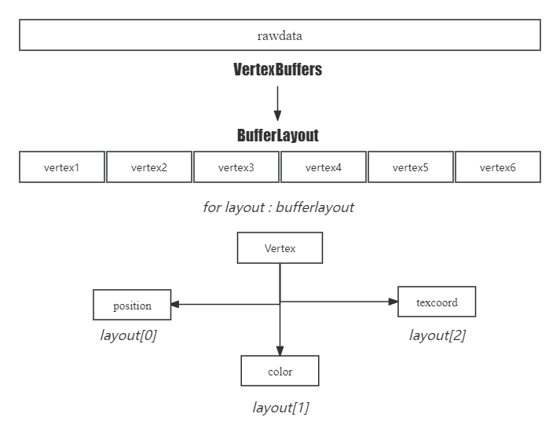

# Swirl

Swirl is a self-made Game Engine project. This project is based on **Hazel of the Cherno** and still on update. The current goal is building a light-weighted 2D game engine and implement a small 3D renderer.

github : [GitHub - LihengW/Swirl: Basic Game Engine under construction](https://github.com/LihengW/Swirl)

## Features

##### 2D renderer based on OpenGL

* Vertex Buffer & Vertex Array

I have to say, it's difficult part for new users to understand the complicate relationships between the Vertex Buffer and Vertex Array. So we decided to modify the structure of these confusing concepts. Now the Buffers just have every thing they need !



* Shader Library

The most important part in Renderer perhaps! We build a wrapped Shader Library. Like most of the engine, the shaders can be editted outside the app, all you need to do is paste the relative route to the Shader receiver. Surely you can create the vertex shader and fragment shader in the same file, but you **HAVE TO** address them like this:

```
#type vertex
#version 330 core


layout ....
in / out ....
void main()
{
    ...
    gl_Position = {};
}

#type fragment
#version 330 core

...
void main()
{
    ...
}
```

* 2D Texure System

Textures! OpenGL has offered us powerful sampler to deal with 2D texture, so what left to do is delivering the pictures' data to the GPU using OpenGL API. 

* Input Events on Windows

* Imgui GUI system

## On Building

* 3D perspective Camera and scene

* Texture System with sampling techsd
